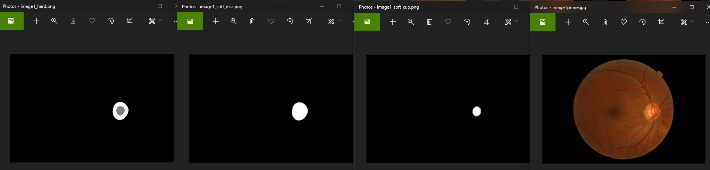
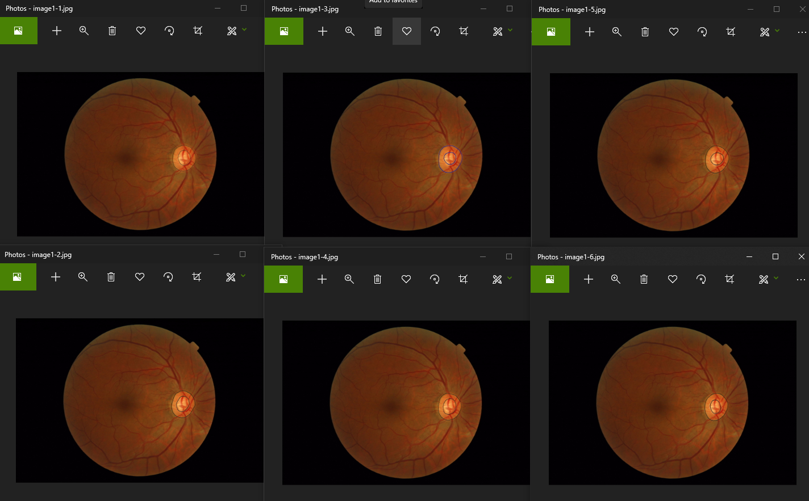

# RIGA segmentation masks
 
## Downloand the masks 
This repository contains the soft and hard segmentation masks of the fundus images of RIGA dataset. (*-Masks directories) </br>
The segmentation masks of each annotation is also provided. (*-segments directories) </br>
You can simply download the the zip file: https://github.com/mohaEs/RIGA-segmentation-masks/raw/main/RIGA_masks.zip

Extracted masks: </br>
 </br>

original dataset annotations: </br>



## Citation 

If you used this dataset, please cite the following report:


Of course, you need to cite the RIGA dataset seperately: </br>
https://doi.org/10.7302/Z23R0R29 </br>
https://doi.org/10.1117/12.2293584

## Reproduction

There is no need to reproduce the masks and sements, but if you are interested you can try following procedure: 

- requirements </br>
use requirements file for creating your environment. If you use the pip version, make sure to install opencv seperately.

- download the RIGA dataset and unzip them same as following tree: </br>
https://deepblue.lib.umich.edu/data/concern/data_sets/3b591905z

```
./
./BinRushed
./BinRushed\BinRushed1-Corrected
./BinRushed\BinRushed2
./BinRushed\BinRushed3
./BinRushed\BinRushed4
./Magrabia
./Magrabia\MagrabiaMale
./Magrabia\MagrabiFemale
./MESSIDOR
```

- extract masks of individual images

for each subset there is main file:

> python main_Messidor.py </br>
> python main_Margrebia.py </br>
> python main_BinRushed.py </br>

Notice that, since the BinRushed subset contains jpeg images, the process for extracting the maps is more complicated and will take much more times.

- combine all masks </br>
In this step, all the segments of each prime are combined, soft and hard masks are generated. 

> python main_CombineMasks.py

## Sources:

The region growing part is modified from: </br>
https://github.com/Spinkoo/Region-Growing
